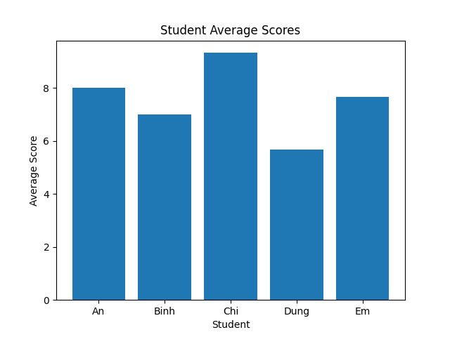

# Student Performance Analysis & Prediction

This project analyzes student scores using Python and applies a simple machine learning model to predict performance.

## Features

- Data analysis with Pandas
- Visualization with Matplotlib
- Student ranking
- Machine learning prediction (Linear Regression)

## Project Structure

data/ → dataset  
src/ → python scripts  
notebook/ → exploratory analysis  
images/ → generated charts  

## Visualization

### Average Score

### Score Distribution

### Subject Comparison

## Machine Learning

Model: Linear Regression  
Features: math, english, science  
Target: average score

Example prediction:

## Tools Used

- Python
- Pandas
- NumPy
- Matplotlib
- scikit-learn